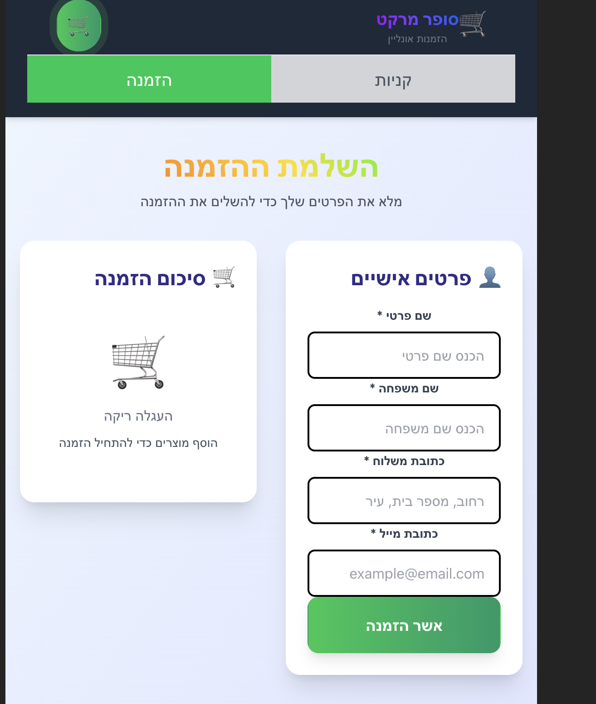
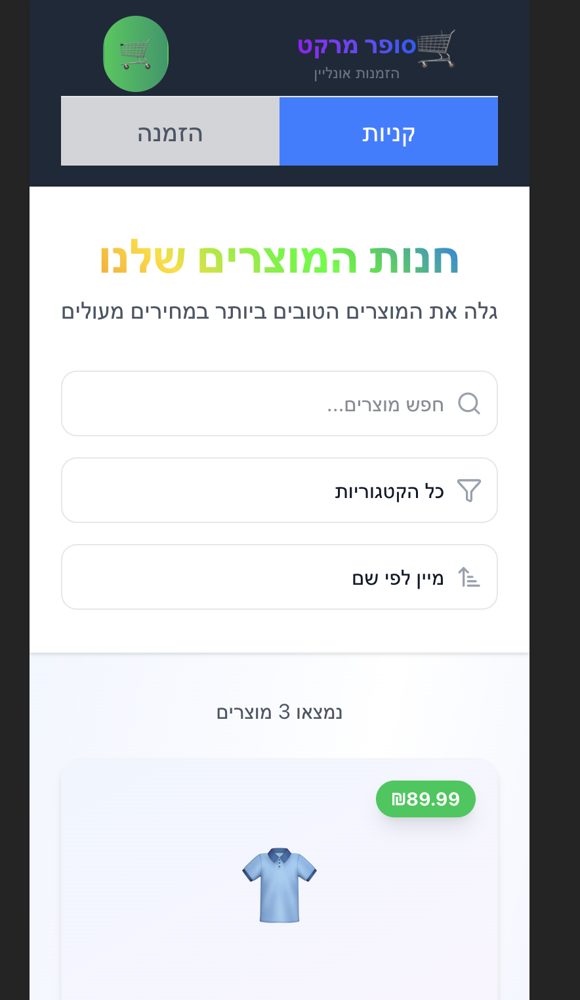

# 🛒 Shopping System Microservices

*A minimal polyglot microservices architecture for an e-commerce demo: ASP .NET Core, Node.js, PostgreSQL, and MongoDB—all containerized.*

## 🔍 Table of Contents

* [Overview](#overview)
* [Architecture](#architecture)
* [Services](#services)
* [Tech Stack](#tech-stack)
* [Prerequisites](#prerequisites)
* [Installation & Run](#installation--run)
* [API Endpoints](#api-endpoints)
* [Databases & Persistence](#databases--persistence)
* [Health & Resilience](#health--resilience)
* [Future Enhancements](#future-enhancements)
* [Contributing](#contributing)
* [License](#license)

## Overview

A demo shopping platform showcasing:

* **server-net**: ASP .NET Core Web API handling orders/users with PostgreSQL
* **server-node**: Express.js API managing products with MongoDB
* **shopping-client**: TypeScript SPA frontend (built with Vite)

All services run in Docker Compose for easy local development and testing.

## Frontend Overview

The shopping client is a modern TypeScript SPA built with Vite, featuring a clean Hebrew interface with two main sections:

### 🛒 Orders Management Screen


The orders screen provides a comprehensive order management interface featuring:
- **Order Completion Process**: Complete order workflow with customer details form
- **Customer Information**: Fields for first name, last name, delivery address, and email
- **Order Summary**: Shopping cart overview with selected items
- **Modern UI**: Clean, responsive design with Hebrew RTL support
- **Order Confirmation**: Submit orders directly to the ASP.NET Core backend

### 🛍️ Products Catalog Screen


The products screen offers a full-featured product browsing experience:
- **Product Search**: Search functionality to find products quickly
- **Category Filtering**: Filter products by categories
- **Price Sorting**: Sort products by price (ascending/descending)
- **Product Display**: Shows product images, names, and prices
- **Real-time Data**: Fetches product data from the Node.js MongoDB backend
- **Responsive Design**: Optimized for various screen sizes

The frontend seamlessly integrates with both microservices, calling the ASP.NET Core API for order management and the Node.js API for product catalog functionality.

## Architecture

The system follows a microservices architecture pattern with clear separation of concerns:

* **server-net** (ASP.NET Core) handles relational data (orders, users) with PostgreSQL
* **server-node** (Node.js/Express) handles document data (products) with MongoDB
* **shopping-client** (TypeScript SPA) provides a modern Hebrew interface calling both APIs


*The frontend communicates with both backend services: fetching products from the Node.js service and submitting orders to the .NET service.*

## Services

| Service Name | Language | Port | Database |
|--------------|----------|------|----------|
| `server-net` | C# / ASP.NET Core | 5177 | PostgreSQL |
| `server-node` | TypeScript / Node | 5001 | MongoDB |
| `shopping-client` | TypeScript (SPA) | 5173 | — |

Each service has its own folder with a Dockerfile and configuration.

## Tech Stack

* **Backend**: ASP .NET Core, Node.js, Express
* **Frontend**: TypeScript, Vite, HTML, CSS
* **Databases**: PostgreSQL, MongoDB
* **Containerization**: Docker, Docker Compose

## Prerequisites

* Docker & Docker Compose (v1.29+)
* Node.js & npm (for frontend development)
* (Optional) .NET 8 SDK, MongoDB, and PostgreSQL if running services outside Docker

## Installation & Run

1. **Clone the repo**

```bash
git clone https://github.com/MosheOgalbo/shopping-system-microservices.git
cd shopping-system-microservices
```

2. **Build & Start**

```bash
docker-compose up --build -d
```

3. **Access the application**
   * **Frontend**: `http://localhost:5173` - Modern Hebrew shopping interface
   * **Orders API**: `http://localhost:5177/api/orders` - ASP.NET Core order management
   * **Products API**: `http://localhost:5001/api/products` - Node.js product catalog

4. **Using the Application**
   * Browse the **Products Screen** (קניות) to view and search the product catalog
   * Use the **Orders Screen** (הזמנה) to place orders with customer information
   * All data persists across container restarts in Docker volumes

## API Endpoints

### **Orders Service** (`server-net`)

* `GET /api/orders` – Retrieve all orders
* `GET /api/orders/{id}` – Retrieve a specific order
* `POST /api/orders` – Create a new order
  * **Body format**:

```json
{
  "user": {
    "firstName": "John",
    "lastName": "Doe",
    "email": "john.doe@example.com",
    "address": "123 Main St, City, Country"
  },
  "items": [
    {
      "productId": "123",
      "name": "Blue Shirt",
      "quantity": 2
    }
  ]
}
```

### **Products Service** (`server-node`)

* `GET /api/products` – Retrieve all products
* `GET /api/products/:id` – Retrieve a specific product
* `POST /api/products` – Create a new product
  * **Body format**:

```json
{
  "Id": 2,
  "Name": "Blue Shirt",
  "Description": "High-quality cotton shirt",
  "Price": 89.99,
  "CategoryId": 2,
  "CategoryName": "Clothing",
  "CreatedAt": "2025-06-26T11:40:17.083613"
}
```

Refer to individual service code for model details and validation.

## Databases & Persistence

* **PostgreSQL**: Data persisted in `postgres-data` volume
* **MongoDB**: Data persisted in `mongo-data` volume

Data remains available across container restarts.

## Health & Resilience

* Each API service has a **health-check** endpoint (`/health` or `/healthz`)
* Docker Compose uses `depends_on` and `healthcheck` to ensure proper startup sequence and automatic restarts on failure.

## Future Enhancements

* Add JWT authentication and API gateway
* Implement CI/CD (GitHub Actions) for automated testing/deploys
* Add unit and integration tests
* Integrate logging, metrics, and observability

## Contributing

Contributions are welcome! Please open an Issue or Pull Request on GitHub.

## License

Licensed under the MIT License.
